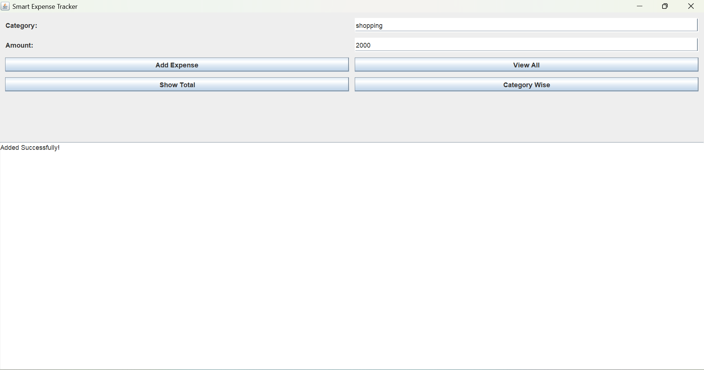

# Smart-Expense-Tracker
Java Desktop Application for managing daily expenses - Engineering Second Year Project
## ✨ Features
- Add Daily Expenses
- View All Transactions
- Calculate Total Expenditure
- Category-wise Expense Breakdown

## 📸 Screenshots

## 🛠️ Tech Stack
- **Language:** Java
- **Framework:** Swing, AWT
- **Data Structure:** ArrayList
- ---
**Developed by:** Vaibhav Ichake  
**College:** [GH Raisoni international skill tech university wagholi, Pune]  
**Year:** Second Year Engineering
